# Robko01 Micro Blocks Integration

## About Micro Blocks

MicroBlocks is a blocks programming language for physical computing inspired by Scratch.

It runs on microcontrollers such as the micro:bit, Calliope mini, AdaFruit Circuit Playground Express, and many others.

 - [Official site](https://microblocks.fun/)
 - [Online programming environment](https://microblocks.fun/run/microblocks.html)

## Idea

This repository is created for one and only purpose, to hold all program based on Micro Blocks related some how to the robot Robko01. The goal is to have a organized place for easy access of the resources for this robot.

## How to run it

Now lets run our first graphical program for Robko01.

 1. Open [MicroBlocks](https://microblocks.fun/run/microblocks.html) programming environment. It is important to know that this WEB editor is only running properly at [Google Chrome]() and [Microsoft Edge](). So if you are now using other browser, consider to change this before continue to the next step.

 2. Because the robot main controller is based on [ESP32]() it is now time to flash it with base firmware. For this purpose click on gear:

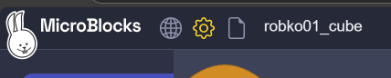

 - Then menu will appear:

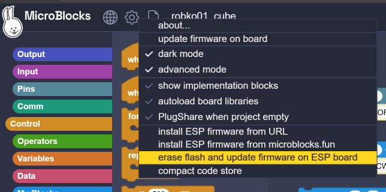

 - Click on the selected item.

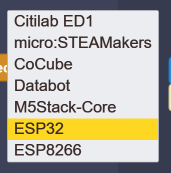

 - Well another menu will came up. Again click on it. And because the robot controller is base on [ESP32]() that why in the menu we select ESP32 item.

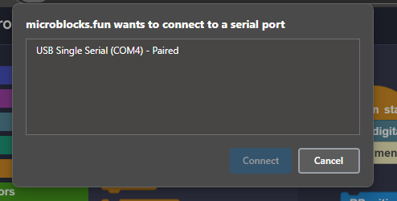

 - Another window will appear this time we select the name of the serial port of our robot.

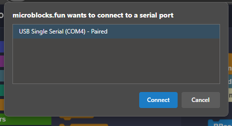

 - Select the right serial port and click "**Connect**"

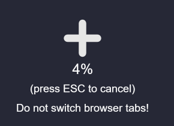

 - A process of flashing is now running.

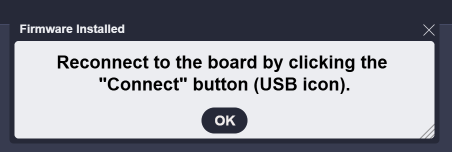

 - If everything is fine a the process of flashing will finish with this message.

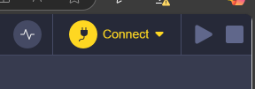

 3. Now it is time to connect to the robot.
There is two ways to do this job.
 - First using the serial cable the same as we flash the controller:

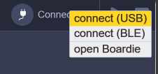

If you decide to use Serial cable do not unplug your robot from the host machine.

 - And second using the bluetooth:

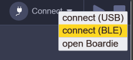

If you decide to use Bluetooth be sure that the bluetooth of your computer is switched on.

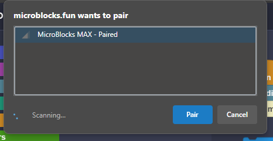

Then click pair.

 4. Load the program.

 5. Край

 - [Back](./README.md)